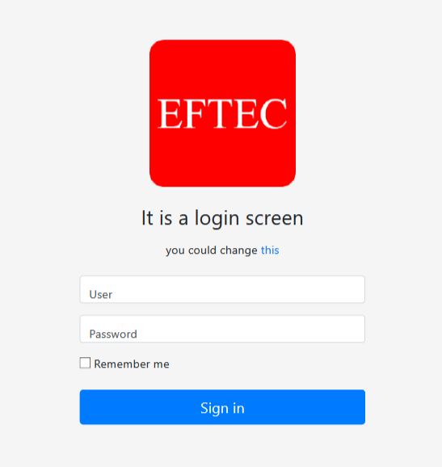
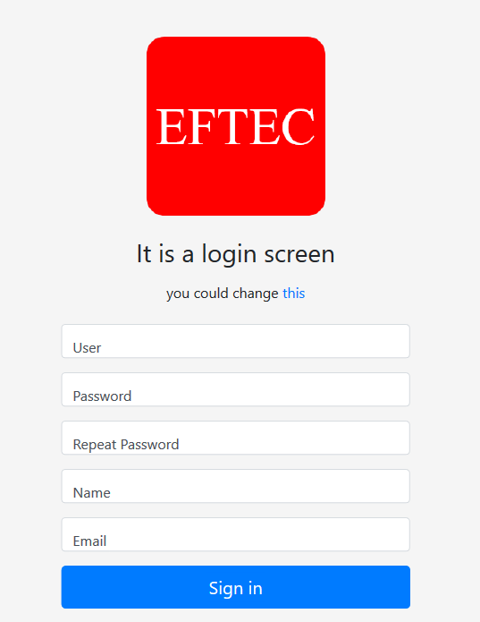

# SecurityOneMysql
It's a security framework for PHP. It includes a login screen that could be customized.

## Features
- Read user from the database.
- Role-based security (optional)
- Group base security (optional)
- Login screen
- Remember password (via cookie). The cookie doesn't store the user or password but a token).
- Register screen
- Activate (after register) screen. The activation is via email.
- Remember the password screen.  It also uses an activation email.

It is totally a beta version. Features could change.

  
Login Screen

  
Register Screen

## version

* 20200811 1.5.3 php>=5.6
* 20200811 1.5.2 
  * Update dependencies.    
  * Fixed a bug creating the tables.  
* 20200405 1.5.1 fixed .gitattributes
* 20200125 1.5 
    * More cleanups. 
    * Now it uses pdo and eftec/pdoone to connects to the database.
* 20181215 1.2 Maintenance
* 20181028 1.1 It fixes a small bug with the extra fields. Now the extra fields are serialized (if any)
* 20181027 1.0 Stable version.
* 20181016 0.16 Changes to login and register screen. Now it's possible to select a different template
* 20181015 0.15 Updated the version of SecurityOne() to 2.x
* 20181015 0.14 Updated the version of ValidationOne()
* 20181015 ~~0.13 Some changes~~
* 20181003 0.12 Some changes
* 20180930 0.11 Beta version.

## Note
 
It's distributed as dual license, as lgpl-v3 and commercial. You can use in a commercial and closed source project.
